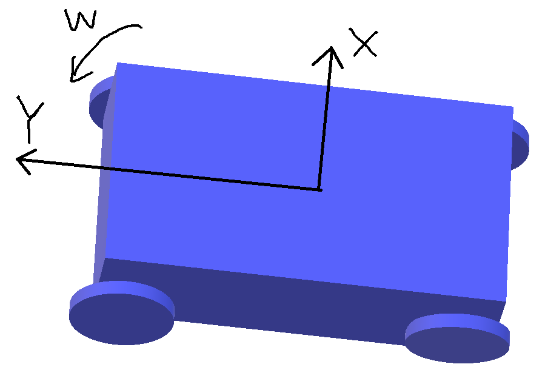

# 什么是随动

---

随动系统指的是两个部分一个主动移动，一个自动跟随主动部分移动。

在RoboMaster中，云台和底盘组成了我们的步兵机器人。操作手通过云台上的图传系统以第一视角操作机器人，这里就用到了随动系统：底盘跟随云台的旋转而旋转。

# 为什么要随动

---

对于操作手来说，操作手是以第一视角来进行操作的。当操作手发出向前移动的指令的时候，机器人需要以操作手视角的前进方向前进。机器人移动依靠底盘。看似好像没有随动什么事。来，让我们看看没有随动时的情况：

底盘运动是按照底盘的前后左右移动，所以当云台左右转动后，云台的前方向和底盘的前方向不是同一方向的。当操作手发出前进指令时，机器人会按照底盘的前进方向移动，而不是操作手的视野前方。操作手第一视角得到的反馈效果就是：我TM怎么在平移？（图下情况为向左前方移动）

如此可以看出来，没有随动系统对于操作手来说简直是灾难！如何解决这个问题呢？只要我们云台左右旋转的时候，底盘也跟随旋转就可以了，达到底盘的前后左右和云台的前后左右相同就可以了，这就是我们随动的目标。（下文中将底盘的前后左右方向和云台的前后左右方向简称为`底盘相对坐标系`和`云台相对坐标系`）

# 实现方案

---

## 硬件介绍

---

### 云台

#### YAW轴电机

上图已经显示了我们控制云台方向的两个电机：YAW轴电机，PICTH轴电机，分别控制左右和上下转动角度。在云台-底盘随动系统中，我们只关心YAW轴电机。

YAW轴电机下半部分固定在底盘上，电机轴带动整个云台左右移动。

#### 码盘

也叫编码器，这里说明的码盘是YAW轴电机的码盘。绝对式编码器，可以记录电机转动了多少角度。有编码器之后就可以测出`底盘相对坐标系`和`云台相对坐标系`的相对角度差（也就是在没有随动时的期望运动方向和实际运动方向之差）。

#### 陀螺仪 & 磁力计

磁力计，安装在云台上，类似指南针，会告诉我们相对于地面来说，云台转了多少角度。获得的角度是`云台相对坐标系`和`空间绝对坐标系`的差（也就是我们操作手想让转动云台的期望值）。

### 底盘

---

#### 麦克纳姆轮

为了实现全向移动，底盘使用麦克纳姆轮，能实现左右平移，旋转。

麦轮可以实现全向移动，但也不是没有缺点，比如给电机输出同样的力，车子向前的合力只有原来的 1 / 根号 2 。

详细介绍：[传送门](https://www.bilibili.com/video/av17229132)

## 控制方法

### 设定

---

记住以下条件，这些是后文讲控制回路的基础：

- 云台YAW轴电机固定在底盘上。

- 云台通过云台YAW轴电机固定在底盘上。

- 磁力计测的是绝对角度。

- 码盘测的是相对角度。

### 图示

- 蓝色部分为底盘。
- 红色部分为云台YAW轴电机和码盘。
- 绿色部分为云台。
- 黄色部分为IMU（磁力计）。

### 控制阶段

---

#### 云台转动

操作手通过鼠标或者遥控器发送云台转动角度给定值（`云台相对坐标系`和`空间绝对坐标系`的相差角度），云台YAW轴电机转动。

#### 底盘转动

底盘跟随云台电机转动，底盘四个电机接受到旋转分量分解值。底盘向云台转动方向转动。

**注意**：云台是通过云台YAW轴电机固定在底盘上的，底盘转动时，云台由于这个固定关系被带动，偏移了我们的设定值。

#### 云台回转

由于云台被底盘带动，IMU检测发现云台没有在我们设定的方向上，于是按与之前相反的方向回转。云台底盘的`相对坐标系`重合，云台-底盘随动系统完成任务。

**说明**：这里是将随动的过程单位控制时间无限放大，响应速度无限提升。可以使用这一套方法来理解随动过程，但是实践运动过程中，由于我们控制回路的运行频率非常地高，所以从外面来看，这三个过程是同时完成的，底盘紧紧地跟着云台转动。

# 鸣谢

---

感谢鹏哥和阿金学长给我们细心讲解随动原理，虽然鹏哥吐槽我问太多为什么（在219单独问鹏哥原理问了一上午，也是辛苦了）。还要感谢RM的队友们，希望这一年我们可以合作愉快，做出成绩，一起冲进全国赛！

> Tell me and I will forget. Show me and I will remember. Involve me and I will understand. --- Chinese proverb, From Robotics, vision and control, Fundamental Algorithms in MATLAB