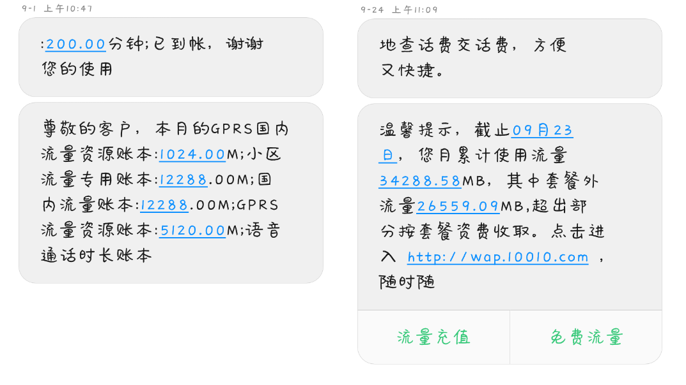
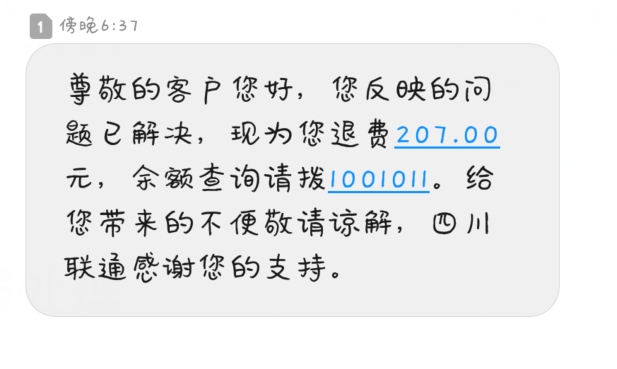

# 事因

---

9月份升级了套餐，原来应该有30G的流量，结果最后只认为我有8个G，扣了200+的话费。突然吃土。

# 客服处理

---

中秋节第二天发现的问题，手机突然连不上网了。于时去找营业厅，说没话费了，以为就是普通的没话费了，冲了40的话费。然后晚上突然又没网了，冲了100话费。第二天又双叒叕没了，查询了余额，最后发现246的话费，0的余额。

打了客服，第一天没反应，第二天终于打来了电话，结果是一个回访电话！？似乎是联通客服后台直接给我点解决了！？怒不可遏，必须差评！然后有又双叒叕给客服打电话，最后，终于在事故出现第五天，客服总算是给我来解决问题了……

# 智斗

>客服打来电话，约我等现在决战，如何对敌？
>都督，客服连拖我五天时间，臭不要脸。现在phone前，老夫只需一些话语，便可让客服拱手而降，联通不战自退。

客服：您好，我们查询了您的话费流量，您的话费是没有问题的。

喵喵喵？简称不愿意退钱，摆一套官话糊弄我，我可不吃这一套。

我：XXXXX（说明情况中）

客服：这个我给你看了，你的流量主要是视频流量。计费是没有问题的。

划水和稀泥，鉴定完毕！

我：我的套餐月初的时候给我的短信说的是有30G的流量，结果现在发来短信，里面说我只有8个G的流量。这个肯定不对啊。

客服：有这个问题的话我这边可以给你退一半的资费。

有点退让，但是……什么！才一半？还是100+话费？不行不行，得把多流出去的钱全部要回来！

我：这样吧，我给你念一下联通发来的短信：9月1号，本月资源账本……（省略短信内容），截至……(省略第二条短信内容)

客服：这个不是你理解的这样的，短信可能本身有点误导……

误导！客服不说我还没想到这个点，既然你说了，我不抓着这个点说怎么好意思呢？

我：既然你们的短信故意对我们消费者进行误导，你们这是属于故意误导消费者的行为，我可以去消费者保护协会告你们；你们这样招揽顾客，对于其他公司造成了不正当竞争，我可以去工商管理局告你们。

（有啥问题就搬出这两个局就可以了）

客服：所以您想怎么处理呢？

怂了哈哈哈哈哈

我：首先这个本来套餐巴拉巴拉，起码总应该有30个G（突然发现还差4个G），我处理这件事，从中秋第二天就开始了，到现在都是第五天了，这几天都没法用流量，我的学习生活收到了极大的影响，算上误工费，就应该只算原来套餐的费用。

客服：好的，（然后说了一堆什么祝您生活顺心的话）

# 结果

最后当然是成功退款了，207元都回来了。这也算是自己第一次成功的维权。之前在营业厅店里的时候，业务员和我说遇到这种问题，态度强硬一点，一般就可以把话费要回来。

写这篇博客呢也就是最近五天都没法正常上网，最后总算完美解决了这个问题，舒坦！

