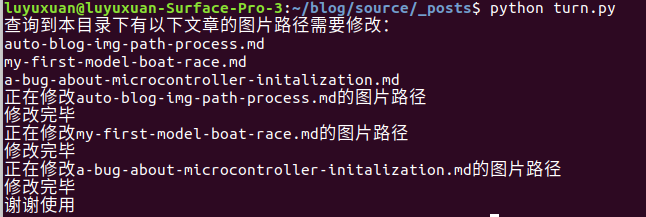

---

title: Hexo博客markdown文件图片路径自动处理脚本
date: 2018-09-05 12:20:36
categories: Python
tags: 
	- 技术
	- python
thumbnail: /img/pexels/desk-nerd.jpeg
toc: true
---

# 问题描述

Hexo博客通过markdown文件来生成html文件。而我们的博客中经常会插入图片，如何方便的让插入的图片经过渲染之后正确地显示在网页上是我们要解决的问题。

传送门：[hexo博客的图片解决方法](https://www.jianshu.com/p/c2ba9533088a)

这里的方案可以在`hexo new post`的时候产生一个文件夹，并且在`hexo g`的时候自动关联图片文件夹和md文件。但是我们在写博客的时候插入图片一般是直接将图片拖入typora中，这样留下的图片路径是绝对路径，但是hexo编译需要我们的图片路径是相对路径才可以正确现实图片。那么怎么整呢？每次拖进去之后切换源码模式然后自己删路径？不不不不，像我们这么聪（lan）明（duo）的人，肯定是要用自动的方式来解决这个问题。

于是就有了这么一个脚本，主要工作思路就是找到带有图片的文章（有同名的文件夹），然后打开文章，用正则表达式寻找图片链接，然后删除前面的路径，只剩下相对路径。


# 使用方法

## 配置

详细方法在上面的链接中。这里就讲一个注意点：

hexo的_config.yml这里的配置

```yml
post_asset_folder: true
```

## 执行

来到_Post的目录下，运行python代码：

```bash
python turn.py
```
大功告成



# 源码

```python
import os
import re

class Article:

    def __init__(self, name):
        self.name = name
        self.dir = name.strip('.md')
        # print(self.name)
        # print(self.dir)

    def run(self):
        f = open(self.name, 'r', encoding='UTF-8')
        f_new = open(self.name + '.new', 'w', encoding='UTF-8')
        print('正在修改' + self.name + '的图片路径')
        lines = f.readlines()
        for line in lines:
            picture_path = re.findall(r'!\[.{0,100}\]\(.{0,10000}\)', line)
            # print(line)
            if picture_path:
                picture_path = picture_path[0]
                # print(picture_path)
                new_path = picture_path[0 : picture_path.index('(') + 1] + picture_path[picture_path.index(self.dir) : ] + '\r\n'
                #print(new_path)
                f_new.write(new_path)
            else:
                f_new.write(line)
        f.close()
        f_new.close()
        # 换文件
        os.remove(self.name)
        os.rename(self.name + '.new', self.name)
        print('修改完毕')

def main():
    article_list = []
    dir_list = []
    article_with_picture_list = []
    files = os.listdir('.')
    # print(files)
    for f in files:
        if '.md' in f:
            article_list.append(f)
        elif '.' not in f:
            dir_list.append(f)
    # print(article_list)
    # print(dir_list)         

    for dir in dir_list:
        for article in article_list:
            if dir in article:
                article_with_picture_list.append(article)
    print('查询到本目录下有以下文章的图片路径需要修改：')
    for article_with_picture in article_with_picture_list:
        print(article_with_picture)
    # 执行转换
    for article_with_picture in article_with_picture_list:
        article = Article(article_with_picture)
        article.run()

    print('谢谢使用')

if __name__ == "__main__":
    main()
```

